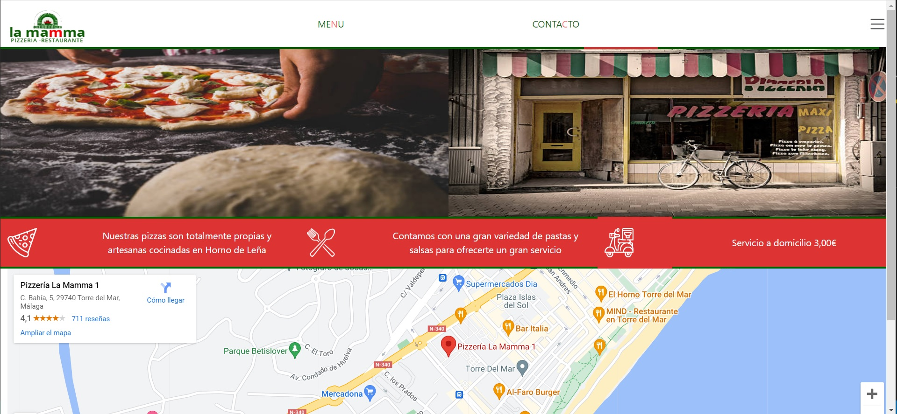
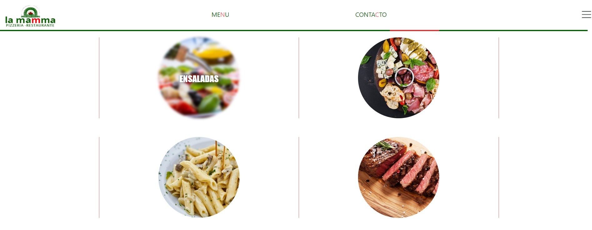
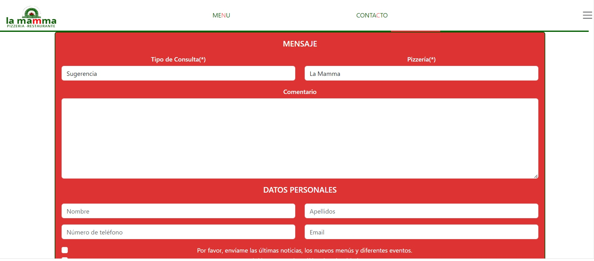

# Carta de Restaurante!

Este es el segundo proyecto del Curso Full Stack Developer de Geekshubs. En él se ha pedido hacer la carta de un restaurante responsive.

Link del proyecto: https://joserr98.github.io/ProyectoCarta/

## Lenguajes utilizados

### Página principal

### Menu

### Formulario

### Contáctame:

  Jose Ruiz